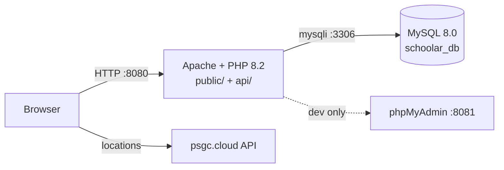

<div align="center">

# 🎓 SCHOOlar

**A scholarship discovery platform for Filipino college students — find, track, and match scholarships near you.**

[](https://www.php.net/)
[](https://www.mysql.com/)
[](https://httpd.apache.org/)
[](https://www.docker.com/)
[](./public/js/)
[](./docs/)

[Quick Start](#-quick-start-docker-recommended) •
[Features](#-features) •
[Stack](#%EF%B8%8F-stack) •
[Project Structure](#%EF%B8%8F-project-structure) •
[Security](#-security) •
[Troubleshooting](#-troubleshooting)

</div>

---

## 📖 About

SCHOOlar connects students with scholarship opportunities from providers like **DOST-SEI**, **CHED**, and local programs. Students register with their academic profile (school, course, GWA, family income, location), then browse, search, save, and check eligibility against real criteria stored in the database. Admins manage scholarship listings through a dedicated portal.

No frameworks, no build step — just PHP, MySQL, and vanilla JS running in Docker.

---

## ✨ Features

| Area | What it does |
|------|--------------|
| 🔐 Auth | Register / login / logout with server-side PHP sessions, role split (`user` vs `admin`) |
| 🏠 Student dashboard | Announcements + scholarships near you |
| 🔎 Find scholarships | Search, nearby-by-location, full detail pages |
| ✅ Eligibility checker | Matches your GWA, income, age, year level, course against per-scholarship criteria |
| 💾 Saved & viewed | Bookmark scholarships, track what you've opened |
| 🔔 Notifications | New matches, deadline reminders, info updates |
| 👤 Profile & settings | Editable student profile |
| 🛠️ Admin portal | Dashboard stats (totals, expiring deadlines), full scholarship CRUD |

---

## 🛠️ Stack

| Layer | Technology |
|-------|-----------|
| Language | **PHP 8.2** (server-rendered pages + JSON API, `mysqli` with prepared statements) |
| Web server | **Apache 2.4** (`mod_rewrite`, security headers, `.htaccess` guards) |
| Database | **MySQL 8.0** (`utf8mb4`, foreign keys, JSON columns for flexible criteria) |
| DB admin | **phpMyAdmin** (Docker service) |
| Frontend | **Vanilla JS + HTML + CSS** (no build step; Poppins/Inter via Google Fonts) |
| External data | [PSGC API](https://psgc.cloud) (Philippine cities/municipalities & barangays) |
| Infra | **Docker + Docker Compose** (works without XAMPP) |
| Passwords | `password_hash()` / `password_verify()` (bcrypt) |

### Architecture



> `public/` is the web root (isolated UI). `api/` sits **outside** the web root in Docker and is exposed via an `Alias` — config, credentials, and SQL are never directly servable. Details in [`docs/FILE_ORGANIZATION.md`](./docs/FILE_ORGANIZATION.md).

---

## 🚀 Quick Start (Docker — recommended)

### 1. Install Docker

- **Windows / Mac:** [Docker Desktop](https://www.docker.com/products/docker-desktop/) — install, open it, wait until the engine says **Running**.
- **Linux:** [Docker Engine](https://docs.docker.com/engine/install/) + the Compose plugin, then make sure `docker info` works.

No PHP, MySQL, or XAMPP needed — the containers bring everything.

### 2. Run it

```bash
git clone https://github.com/ShiroX1206/schoolar.git
cd schoolar
docker compose up --build
```

That's it. First boot auto-imports the schema + seed data (takes ~30s for MySQL init).

| Service | URL |
|---------|-----|
| 📱 App | http://localhost:8080 |
| 🗄️ phpMyAdmin | http://localhost:8081 (server `db`, user `schoolar` / `schoolarpass`) |

### 3. Log in

| Role | Email | Password |
|------|-------|----------|
| 🛠️ Admin | `admin@schoolar.local` | `admin123` |
| 🎓 Student | `student@schoolar.local` | `User123!` |

> ⚠️ Change these before any defense/demo. Admins log in at `/admin/admin-login.html`, students at `/login.html`.

### Useful commands

```bash
docker compose ps                 # container status
docker compose logs -f web        # follow Apache/PHP logs
docker compose logs -f db         # follow MySQL logs
docker compose down               # stop (keeps data)
docker compose down -v            # stop + DELETE database (fresh reseed next boot)
```

---

## 💻 Alternative: XAMPP

1. Install [XAMPP](https://www.apachefriends.org/) with PHP ≥ 8.1 and MySQL, start **Apache** + **MySQL**.
2. Copy this folder to `C:\xampp\htdocs\SCHOOlar`.
3. Import `database/schoolar_schema.sql`, then `database/phase3_seed_scholarships.sql` (phpMyAdmin → Import). Optional: `database/phase3_fix_gwa_scale.sql` (already applied to the seed — only needed for older DBs).
4. Open http://localhost/SCHOOlar/public/

`api/config/database.php` reads `DB_HOST`/`DB_NAME`/`DB_USER`/`DB_PASS` from the environment and falls back to XAMPP defaults (`localhost` / `schoolar_db` / `root` / empty password), so no code changes when switching environments.

---

## 🗂️ Project Structure

```
schoolar/
├── public/                 # 🌐 ALL browser UI (Apache DocumentRoot in Docker)
│   ├── index.html login.html register.html
│   ├── css/  js/  images/  icons/
│   ├── user/               # 9 guarded .php pages (role: user)
│   ├── admin/              # admin-login.html (public) + 2 guarded .php
│   └── .htaccess           # *.html → *.php so the guarded copy always wins
├── api/                    # 🔌 JSON backend (outside web root in Docker)
│   ├── auth/               # login, register, me, logout
│   ├── user/               # profile, interactions (save/view), notifications
│   ├── scholarships/       # public listing + helpers
│   ├── admin/              # scholarship CRUD (role: admin)
│   ├── reference.php       # schools & courses lookup
│   └── config/             # database, session, guard, auth, response — NEVER served
├── database/               # schema + seeds + GWA-scale fix
├── docker/
│   ├── apache/schoolar.conf
│   └── php/custom.ini      # hardened session defaults
├── docs/                   # Docker guide, security notes, layout, legacy READMEs
├── _old_backend_unused/    # quarantined legacy code (blocked, safe to delete)
├── Dockerfile
├── docker-compose.yml
└── .env.example
```

**Key API endpoints** (all JSON):

```
POST /api/auth/register.php /api/auth/login.php /api/auth/logout.php
GET  /api/auth/me.php
GET  /api/reference.php?type=schools|courses&school_id=...
GET  /api/scholarships/list.php[?include_unavailable=1]
GET/POST /api/user/profile.php  /api/user/interactions.php  /api/user/notifications.php
GET/POST/PUT/DELETE /api/admin/scholarships.php
```

---

## 🔒 Security

Client-side checks alone can't protect pages (view-source/curl bypass them), so every protected page is a **`.php` file that enforces the session on the server before any HTML is emitted**:

- `schoolar_session_start()` — `HttpOnly` + `SameSite=Lax` cookies, strict mode, 2-hour idle timeout, user-agent/IP fingerprint, ID regeneration on login.
- `require_page_auth("user"|"admin")` — server-side 302 to the right login + `no-store` cache headers (logout back-button shows nothing).
- Unhandled `*.html` twins redirect to their guarded `*.php`; `api/config/`, `*.sql`, `.env`, and legacy code return 403.
- All SQL uses prepared statements; passwords are bcrypt-hashed.

Full write-up (including a real `?>`-in-comment bug caught during Docker testing): [`docs/SECURITY.md`](./docs/SECURITY.md).

---

## 🧰 Troubleshooting

<details>
<summary><b>Port 8080/8081 already in use</b></summary>

Change the left side of the port mapping in `docker-compose.yml` (e.g. `"8080:80"` → `"8090:80"`) and re-run `docker compose up`.
</details>

<details>
<summary><b>Database looks empty / login fails after code changes</b></summary>

Seed scripts run only on first init. Reseed cleanly with `docker compose down -v && docker compose up --build`. (This deletes local DB data — fine for dev.)
</details>

<details>
<summary><b>Docker daemon not running (Windows)</b></summary>

Open **Docker Desktop** from the Start menu and wait for the green "Engine running" state, then retry. `docker info` should print server details.
</details>

<details>
<summary><b>Pages show PHP source or API returns 404 in Docker</b></summary>

You have a stale image. Rebuild: `docker compose up --build -d web`. The current `Dockerfile` + `schoolar.conf` pin the PHP handler and the `/api` alias.
</details>

---

<div align="center">

Built with PHP + MySQL + Docker · UI in `public/`, API in `api/`, sessions enforced server-side.

</div>
